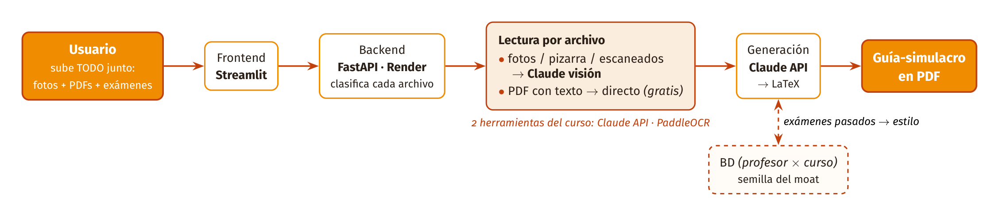

# Rendir.ai

> **Rendir.ai convierte una foto de tus apuntes en un simulacro de examen con el estilo de preguntas de tu propio profesor.**

Proyecto Final — *Data Science con Python 2026-I*, Universidad del Pacífico.
Founder solo: **Jorge Luis Valer Osis**.

---

## El problema
Los estudiantes universitarios estudian "a ciegas": no saben qué tipo de **preguntas de
desarrollo** les tomará su profesor, y armar simulacros realistas a mano toma horas. Pegar todo en
ChatGPT no funciona bien porque (a) los apuntes están **a mano o en foto de pizarra** y (b) las
preguntas que genera son **genéricas**, no al estilo del docente.

> **Validado con 7 entrevistas** a estudiantes (metodología YC) → ver
> [`docs/research/hallazgos_entrevistas.md`](docs/research/hallazgos_entrevistas.md).

## La solución (y el insight)
Subes una **foto de tus apuntes** + opcionalmente **exámenes pasados del profesor**, y Rendir.ai
te genera un **simulacro con el estilo de preguntas de ESE profesor**.

- **Insight:** en LatAm los exámenes son de desarrollo y cada profesor tiene un estilo repetitivo y
  reconocible. Modelamos al docente, no a "un curso genérico".
- **Moat:** dataset propio por *(profesor × curso)*. Cada examen subido mejora la predicción para el
  siguiente alumno de ese profesor → efecto de red difícil de copiar.

## Arquitectura — lector híbrido
```
[Foto de apuntes] --> Frontend (Streamlit)
                           |
                           v
                 Backend (FastAPI / Render)
        manuscrito/pizarra |        | impreso/PDF        | generación
                           v        v                    v
                   Claude visión  PaddleOCR        Claude API
                   (/transcribe)  (/ocr)           (/generate -> simulacro)
                           |
                           v
                 BD (profesor x curso x exámenes)  <-- semilla del moat
```
**Diagrama en alta resolución:**



> **Por qué híbrido:** PaddleOCR es excelente con texto **impreso** (gratis, sin tokens) pero
> falla con **letra a mano / pizarra**; ahí Claude visión lee mucho mejor. Enrutamos cada tipo
> de material a la herramienta adecuada.

## Herramientas del curso usadas (≥2 obligatorias)
| Herramienta | Lectura | Dónde en el código | Por qué |
|---|---|---|---|
| **Claude API (visión + generación)** | 14 | `backend/app/claude_client.py` (`/transcribe`, `/generate`) | Lee manuscrito/pizarra y genera el simulacro al estilo del profesor |
| **PaddleOCR** | 14 | `backend/app/ocr.py` (`/ocr`) | OCR de material impreso/PDF en español, gratis y sin costo de tokens |

## Cómo correr (local)

> **Entorno:** este proyecto se ejecuta en el conda env **`geo`** (Python **3.10.20**), que ya
> incluye `paddlepaddle 2.6.1`, `paddleocr 2.7.3` y `numpy 1.26`. **Actívalo en cada terminal
> antes de instalar o correr** (el prompt debe pasar de `(base)` a `(geo)`):
> ```bash
> conda activate geo
> ```
> Como `geo` ya trae el stack de PaddleOCR, el `backend/requirements.txt` incluye **solo las
> dependencias web** (FastAPI, etc.) y usa rangos para no degradar lo que `geo` ya tiene. El
> stack de OCR vive aparte en `backend/requirements-ocr.txt` (solo para deploy / entorno fresco).

```bash
# Backend (terminal 1, con `geo` activo)
cd backend
pip install -r requirements.txt        # solo deps web; `geo` ya trae PaddleOCR
cp ../.env.example ../.env             # completa ANTHROPIC_API_KEY (necesario desde el Día 2)
uvicorn app.main:app --reload

# Frontend (terminal 2, con `geo` activo)
cd frontend
pip install -r requirements.txt
streamlit run app.py
```

> **En un entorno FRESCO o el deploy (Render):** instala además el stack de OCR:
> ```bash
> pip install -r backend/requirements-ocr.txt
> ```

> **GPU opcional (solo local):** por defecto PaddleOCR corre en CPU (igual que en el deploy de
> Render). Si tienes GPU NVIDIA y quieres acelerar, sigue `backend/requirements-gpu.txt` y pon
> `USE_GPU=true` en tu `.env`.

## Demo desplegado
🔗 **App (pruébala sin instalar nada):** https://mi-startup-lmtgtvyvoyedk4rvirh25a.streamlit.app
🧠 **API backend (FastAPI, inspeccionable):** https://rendir-ai-backend.onrender.com/docs
🎥 **Video demo (2–3 min):** [ver en Drive](https://drive.google.com/file/d/1k95cF7SYhDxElduFXnFscAsWIWOlt3ve/view?usp=drive_link) · guion en `docs/video_demo.md`
🖼️ **Capturas del flujo:** ver [`docs/capturas/`](docs/capturas/)
📊 **Pitch deck (14 secciones YC):** ver [`docs/pitch_deck.pdf`](docs/pitch_deck.pdf)

> **Cómo probarlo:** abre la app → escribe curso y profesor → **sube TODO tu material junto**
> (fotos de apuntes y/o exámenes pasados, PDFs escaneados o con texto; la app clasifica cada archivo
> y usa la herramienta correcta) → *(opcional)* pega texto de un examen pasado → **genera la guía en
> PDF**. *(El backend en Render free se duerme tras ~15 min de inactividad; la primera petición puede
> tardar ~50s mientras despierta.)*

## Estructura del repo
```
README.md  LICENSE  .env.example  .gitignore  render.yaml  .devcontainer/
docs/
  research/        # guion + hallazgos de entrevistas (validación del problema)
  capturas/        # capturas del flujo principal (galería del demo)
  video_demo.md    # guion del video demo
frontend/          # Streamlit — app.py (UI, modo claro/oscuro, lectura mixta)
backend/           # FastAPI
  app/             # main.py (endpoints), claude_client.py, ocr.py, pdf.py, latex_pdf.py, config.py
  tests/           # pytest
  requirements*.txt
ai/                # prompts (transcribe, generate)
data/              # muestras chicas anonimizadas
notebooks/         # EDA del estilo de preguntas
scripts/           # utilidades locales (p. ej. transcripción de entrevistas con Whisper)
.github/workflows/ # CI (lint + tests)
```

## Construido con agentes de IA
Repo asistido con **Claude Code** (CTO backend) y Claude/Codex (frontend).

## Licencia
MIT — ver `LICENSE`.
