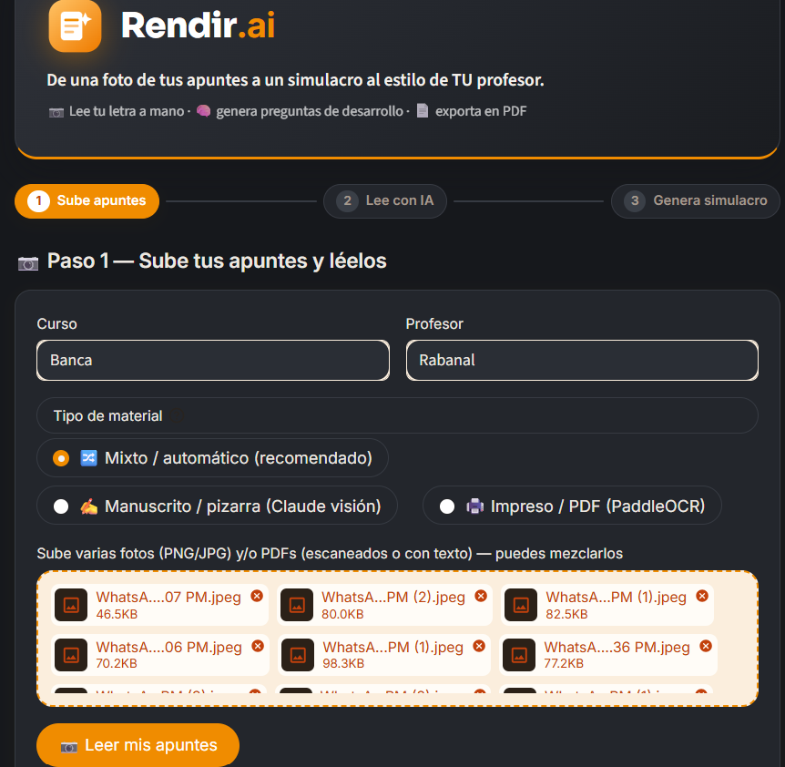
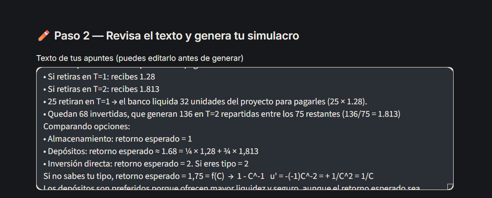
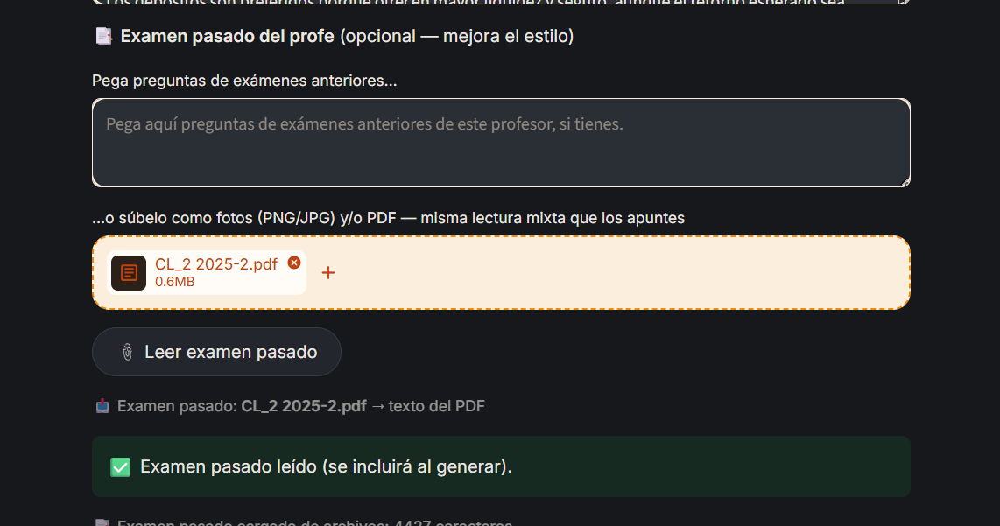
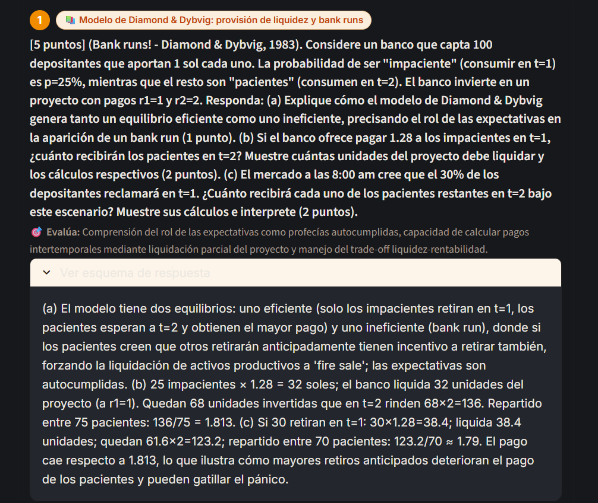
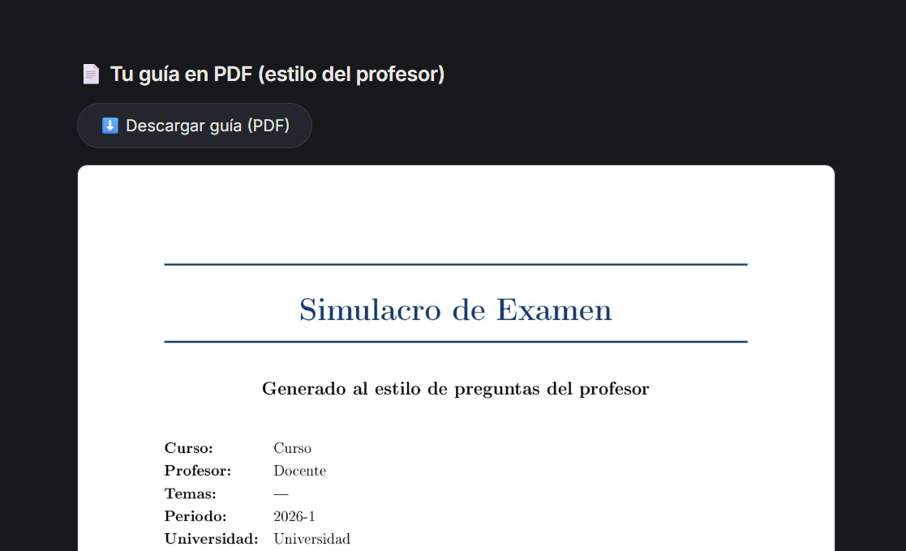

# Capturas del flujo — Rendir.ai

Capturas (de un usuario real) del flujo principal de Rendir.ai, tomadas sobre la app en modo oscuro.
Curso de ejemplo: **Teoría Bancaria**.

🔗 Demo en vivo: https://mi-startup-lmtgtvyvoyedk4rvirh25a.streamlit.app

### 1 · Inicio y subida mixta

Curso y profesor + **subida mixta**: varias fotos de apuntes y/o PDFs a la vez (modo automático).

### 2 · Lectura de los apuntes

El texto extraído de las fotos con el **lector híbrido** (Claude visión para manuscrito/pizarra).

### 3 · Examen pasado del profe (PDF)

El examen pasado se sube como **PDF** (o fotos) y se lee con la misma lógica mixta — mejora el estilo del simulacro.

### 4 · Simulacro generado

Preguntas de **desarrollo al estilo del profesor**, con tema y qué evalúa cada una.

### 5 · Guía-simulacro en PDF

La guía **resuelta** exportada en PDF con estilo académico (portada + problemas con enunciado, marco teórico y solución).
