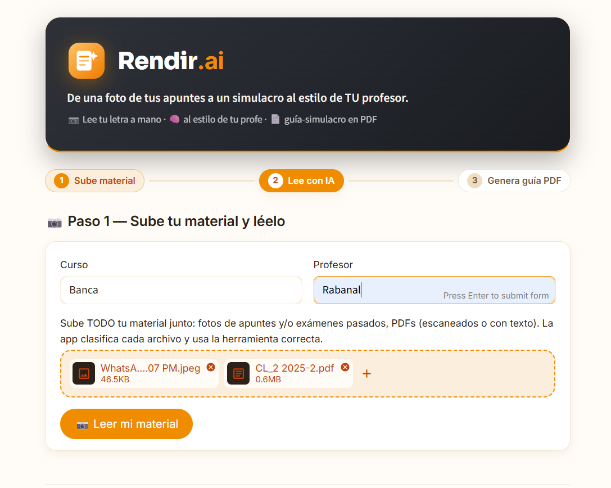
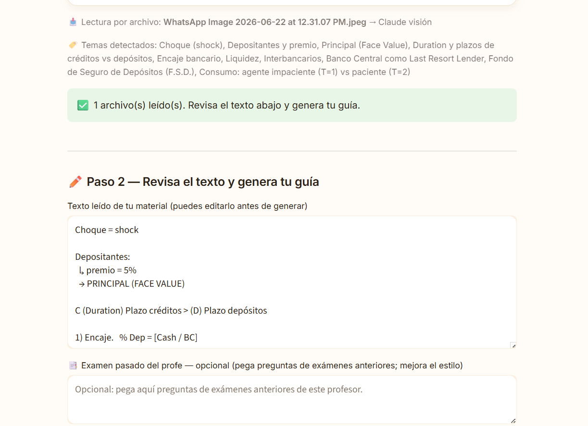
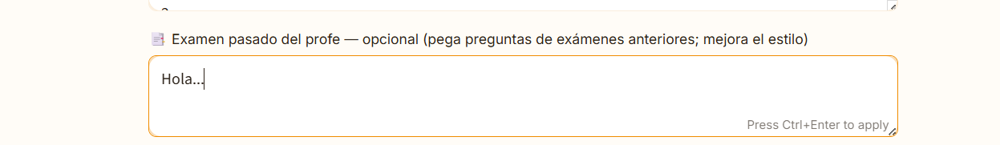
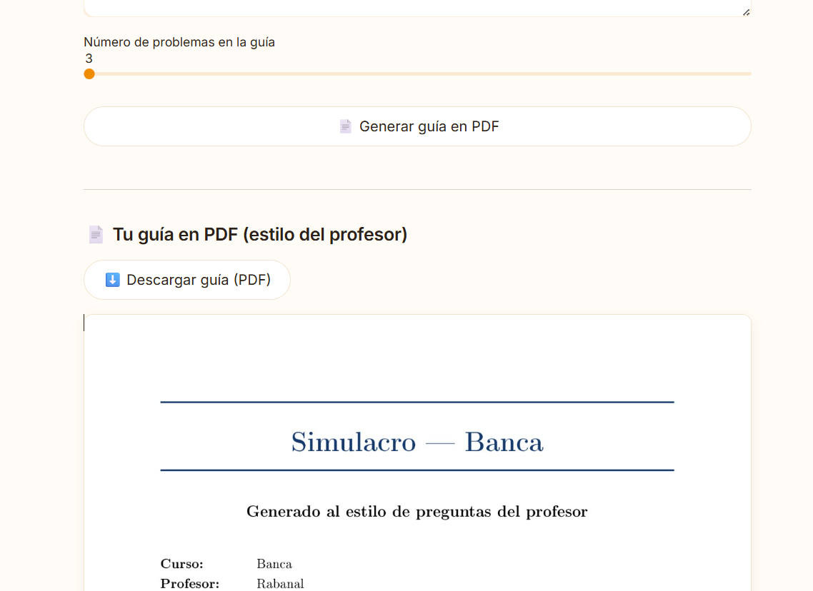
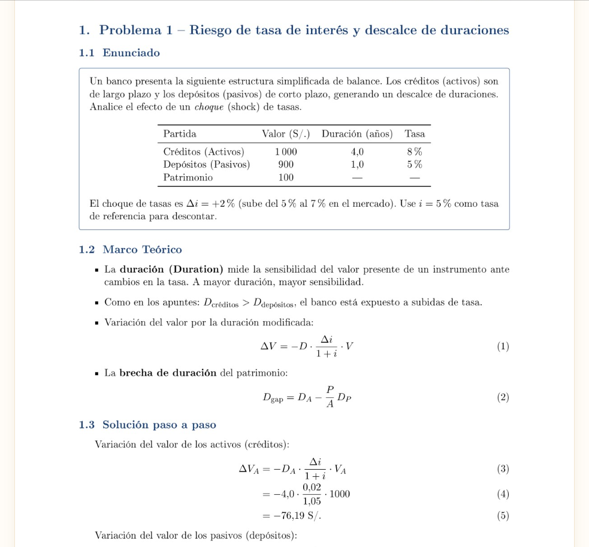

# Capturas del flujo — Rendir.ai

Capturas del flujo principal (de un usuario real), en modo claro. Curso de ejemplo: **Banca**.

🔗 Demo en vivo: https://mi-startup-lmtgtvyvoyedk4rvirh25a.streamlit.app

### 1 · Subida única (sin selector de tipo)

Escribes curso y profesor y subes **todo tu material junto** en un solo uploader: fotos de apuntes
**y** exámenes pasados, fotos **y** PDFs. Ya no hay que elegir el tipo de material.

### 2 · Lectura + clasificación automática

La app **clasifica cada archivo y usa la herramienta correcta**: la línea *"Lectura por archivo"*
muestra el motor de cada uno (Claude visión para fotos/escaneados, texto directo para PDFs con
texto), más los temas detectados.

### 3 · Examen pasado (opcional)

Bandeja **opcional** para pegar texto de un examen pasado del profesor — mejora la fidelidad al
estilo. No es un paso obligatorio.

### 4 · Generar la guía en PDF

Un solo botón **"Generar guía en PDF"** produce la guía-simulacro resuelta al estilo del profesor.

### 5 · Contenido del PDF (estilo académico)

La guía **resuelta** en PDF (LaTeX): enunciado, marco teórico y solución paso a paso.
